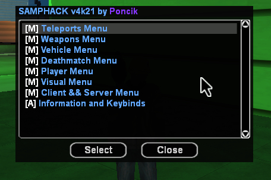
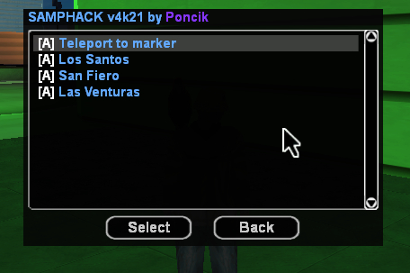
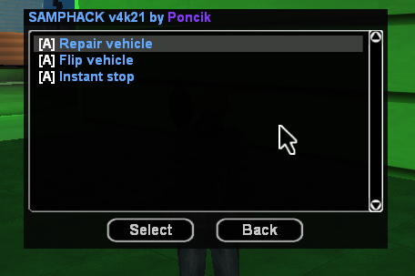
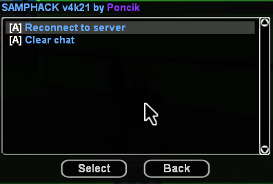

## SAMPHACK v4k21 by Catalin Grigoriev

### Introduction 

SAMPHACK is a modification for SAMP, it created to use 
it to play more confortable SAMP, but some people use it 
at cheat client as the name! It include teleports, weapons, 
and other cool stuff :
  Teleport Menu :  

  Vehicle Menu :  

  Client Menu :  
 

### Instalation 

The instalation is very easy, you need to download the 
code from [DOWNLOAD CODE](https://github.com/catalingrigoriev50/samphack/archive/refs/heads/main.zip) and install al files in your 
game directory. You also need to have the version of SAMP : 0.3.7 
on newest versions the cheat will not work!

